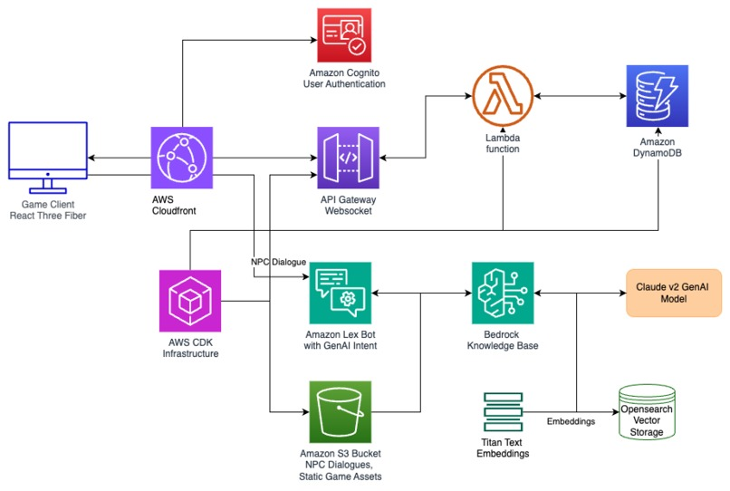

# Monke Game 🎮

A React Three fiber game built using AWS amplify , cognito , cdk ,lambda, API gateway , DynamoDB , bedrock , lexv2 gen AI bots , Vectorised knowledge base, Amazon opensearch for game builder challenge 

## 🎥 Demo

To Run , 

npm install 
npm run dev

Configure your environment by checking .envexample

SYSTEM DESIGN

 

Backend with AWS cdk resources and lambda handler here :
https://github.com/ankithreddypati/MonkeBackend

This game uses 3D assets created in Blender by me and other assets licensed under Creative Commons:

